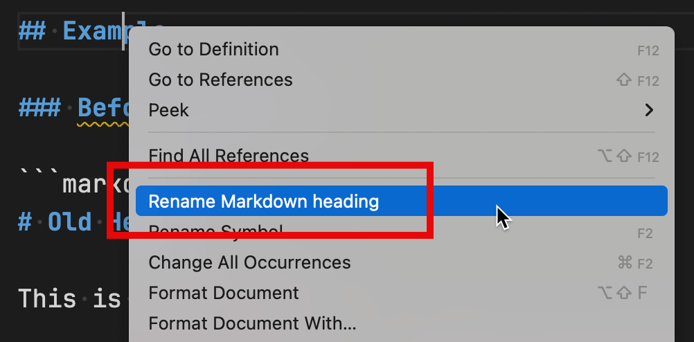

# Rename Markdown Heading

This Visual Studio Code extension allows you to rename a Markdown heading and automatically update all references (anchor links) to it.

## Usage



1. Open a Markdown file in Visual Studio Code.
2. Right-click a Markdown heading and select **Rename Markdown heading**. Alternatively, run the `Rename Markdown heading` command from the Command Palette (`Ctrl+Shift+P` or `Cmd+Shift+P` on macOS).
3. Enter the new name for the heading.

The heading is renamed, and all references to it (e.g., `[link text](#old-heading)`) are updated.

## Example

### Before Renaming

```markdown
# Old Heading

This is some content.

Here's a [link to the heading](#old-heading).
```

### After Renaming

```markdown
# New Heading

This is some content.

Here's a [link to the heading](#new-heading).
```
